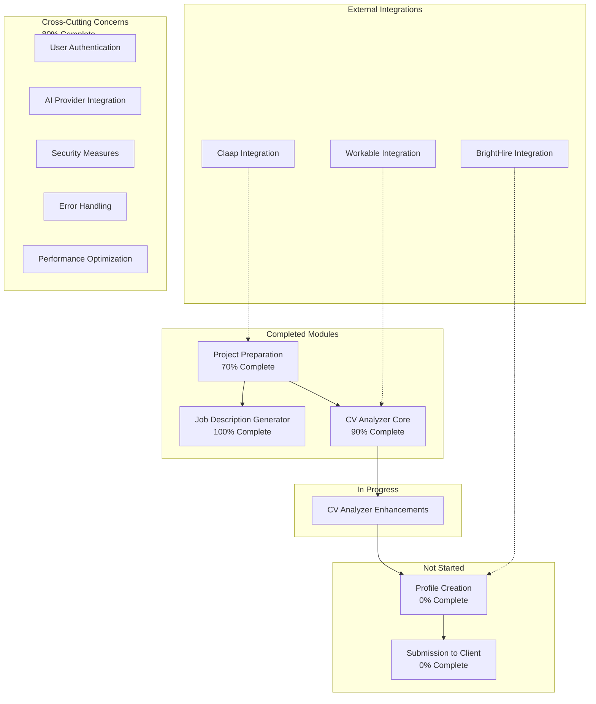
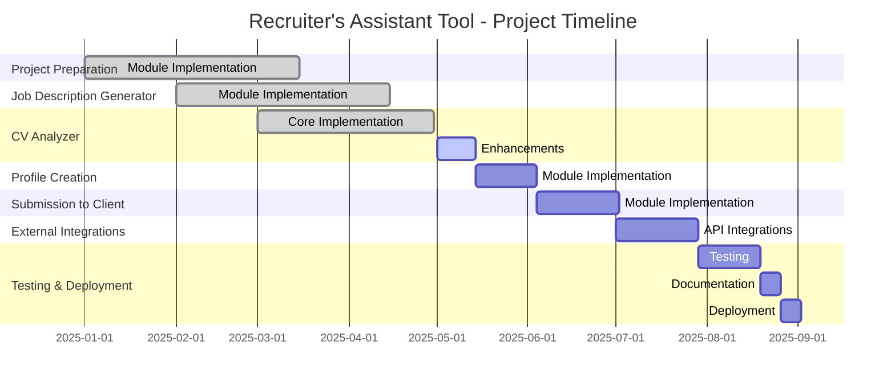
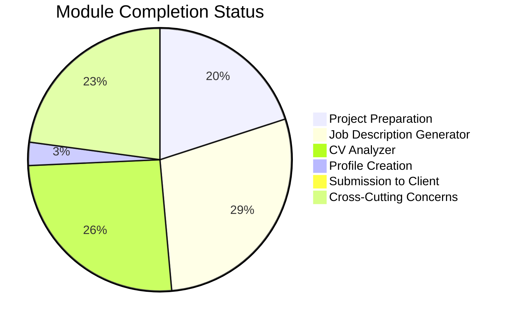
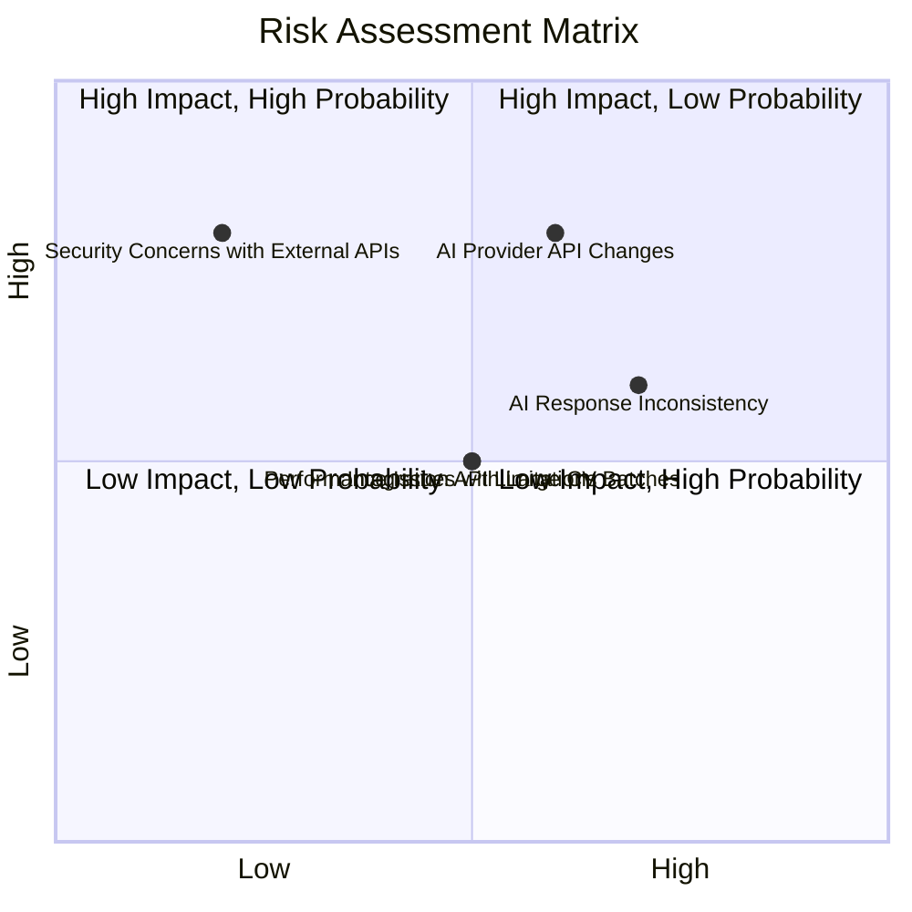

# Recruiter's Assistant Tool - Project Plan Diagrams

## Project Modules and Dependencies



## Project Timeline (Gantt Chart)



## Module Completion Status



## Feature Status by Module

```mermaid
xychart-beta
    title "Feature Status by Module"
    x-axis ["Project Preparation", "Job Description Generator", "CV Analyzer", "Profile Creation", "Submission to Client", "Cross-Cutting Concerns"]
    y-axis "Number of Features" 0 --> 14
    bar [7, 6, 12, 1, 0, 6]
    bar [2, 0, 0, 1, 0, 2]
    bar [1, 0, 1, 5, 6, 0]
    legend ["Completed", "In Progress", "Not Started"]
```

## Risk Assessment Matrix



## Next Steps Priority

1. **Complete CV Analyzer Enhancements**
   - Finalize any remaining issues with the chat interface
   - Implement additional error handling for AI responses
   - Add more comprehensive documentation

2. **Start Profile Creation Module**
   - Implement key data extraction from resumes
   - Create UI for profile generation
   - Implement AI-generated summaries

3. **Begin Submission to Client Module**
   - Design email template generation
   - Implement candidate strength highlighting
   - Create UI for email editing

4. **External Integrations**
   - Implement Workable integration for CV Analyzer
   - Implement BrightHire integration for Profile Creation
   - Implement Claap integration for Project Preparation

## Critical Path

The critical path for project completion is:

1. Complete CV Analyzer Enhancements (2 weeks)
2. Implement Profile Creation Module (3 weeks)
3. Implement Submission to Client Module (4 weeks)
4. Implement External Integrations (4 weeks)
5. Testing and Bug Fixes (3 weeks)
6. Documentation and Deployment (2 weeks)

Total remaining time: Approximately 18 weeks